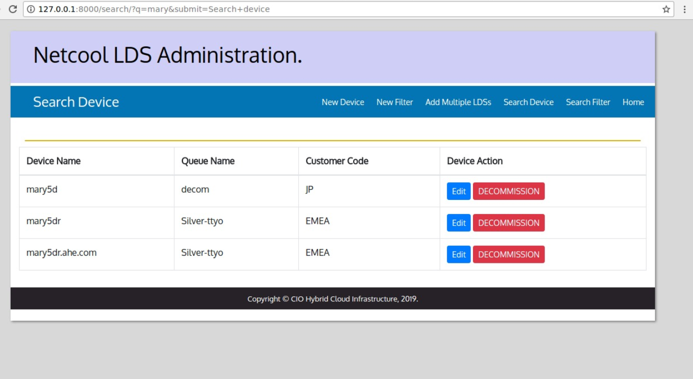
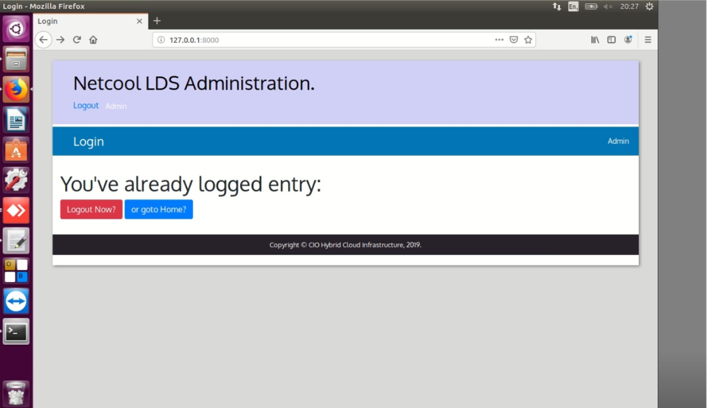

# Netcool-LDS-Administration-

#install imb-db2 in Ubuntu[[Go](http://www.techienote.com/how-to-download-and-install-ibm-db2-database-on-ubuntu/)] Or Centos[[GO](https://blog.toadworld.com/2017/08/11/how-to-install-ibm-db2-developer-edition-on-centos-7-using-docker)]





We need to clarify what the application does.
- In general, the system is for managing devices connected over the network based on their mail addresses
The system is managed by many administrators,
- Administrators are divided into groups of users, each with different powers than the other group.
- Encrypt database passwords and ldap.

- New users can be added only through the responsible user

- All users can add new devices either individually or through a csv file
- They can add filters and connect them to different devices.
- They can also use a search engine to search within devices or filters in the database
- and only some users can edit the previously added devices.
- The application log and all commands that address the database are saved directly, and only officials can view this data.

- Here are some other details..

1-The login screen integrated with LDAP and setting permissions for a few people can see all APP options and track records.
- The first screen of the application is "Sign in", which accesses this screen must be informed of the login (must be via LDAP) and then the password of the login.

2- Not all users can obtain the same privileges (permissions) to perform tasks in the application. For this reason, we do have powers to grant or remove user permissions in order to delete, add or change devices or filters.

3 - If the user types "EMEA", the database will receive the code "ige", but this option needs to do the following: If the user types "EMEA" and the device name contains the characters ".ahe". In the "FQDN" field, the code that will be sent to the database will be "ehe", but if it does not contain these characters, the symbol will continue to "ige"

#Crate Database..
```shell
#su - db2inst1 #db2inst1 vs your user
$db2 CREATE DATABASE GSMALDS
$db2 connect to gsmalds
```
#Crate Tables..

```shell
$ db2 "CREATE TABLE RIDALIAS (ID INTEGER(4) NOT NULL ,
                                    RESOURCEID VARCHAR(25) NOT NULL,
                                    ALIAS VARCHAR(25) NOT NULL,
                                    LASTSAVEDDATE DATE NULL,
                                    UPDATEORIGIN INTEGER(4) NULL,)"

```
```shell
$ db2 "CREATE TABLE COMPUTERSYSTEM (ID INTEGER(4) NOT NULL ,
                                    RESOURCEID VARCHAR(25) NOT NULL,
                                    CICLASS VARCHAR(25) NULL,
                                    OSRUNNING VARCHAR(25) NULL,
                                    FQDN VARCHAR(25) NOT NULL,
                                    SUPPORTORG VARCHAR(25) NULL,
                                    CUSTOMERCODE VARCHAR(10) NOT NULL,
                                    COUNTRYCODE VARCHAR(10) NOT NULL,
                                    UPDATEORIGIN INTEGER(4) NULL,
                                    LASTSAVEDDATE DATE,
                                    RESOURCETYPE INTEGER(4) NULL,
                                    RESOURCEUSAGE VARCHAR(10) NULL,
                                    KMANAGED INTEGER(4) NULL)"
```
```shell
$ db2 "CREATE TABLE AUTOMATIONFILTERS (ID INTEGER(4) NOT NULL ,
                                       CUSTOMERCODE VARCHAR(25) NOT NULL,
                                       FILTERNAME VARCHAR(25) NOT NULL,
                                       FILTERDESC VARCHAR(25) NOT NULL,
                                       FILTERSTATE INTEGER(4) NULL,
                                       FILTERWEIGHT INTEGER(4) NOT NULL,
                                       SUBACCOUNT VARCHAR(25) NOT NULL,
                                       TICKETGROUP VARCHAR(25) NOT NULL,
                                       TICKETACTIONID INTEGER(4) ,
                                       KMANAGED INTEGER(4) NULL)"

```

#install python &Tools |LIB

```bash
pip3 install ibm_db==2.0.8a
pip3 install ibm_db_django==1.2.0.0
pip3 install django==2.1.7
pip3 install pandas
pip3 install pycrypto
```

#Run
```shell
$python3 manage.py migrate
#This creates the tables we want and in the correct format within the database
```
```shell
$python3 manage.py runserver
```


#use LDAPSearch 
```python
import ldap
from django_auth_ldap.config import LDAPSearch, LDAPSearchUnion

AUTH_LDAP_USER_SEARCH = LDAPSearchUnion(
    LDAPSearch("ou=users,dc=example,dc=com", ldap.SCOPE_SUBTREE, "(uid=%(user)s)"),
    LDAPSearch("ou=otherusers,dc=example,dc=com", ldap.SCOPE_SUBTREE, "(uid=%(user)s)"),
)
```
